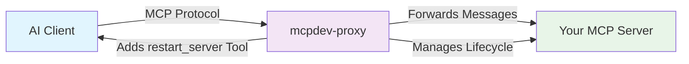

# 🔄 mcpdev-proxy

[](https://badge.fury.io/js/mcpdev-proxy)
[](https://opensource.org/licenses/MIT)
[](https://nodejs.org/)

> **Hot-reload your MCP servers without restarting your AI coding assistant**

A transparent development proxy for the Model Context Protocol (MCP) that enables seamless hot-reloading of MCP servers during development. Perfect for AI coding sessions with Claude Code, Cursor, Windsurf, and other MCP-enabled clients.

## 🎯 Why mcpdev-proxy?

When developing MCP servers, you typically need to restart your entire AI coding session every time you make changes to your server code. This breaks your development flow and loses context.

**mcpdev-proxy solves this by:**
- 🔄 **Hot-reloading** your MCP server without disconnecting the client
- 🔧 **Preserving session state** between server restarts  
- 🛠️ **Adding a `restart_server` tool** that your AI agent can call
- 🌊 **Transparent forwarding** of all MCP protocol messages
- 📡 **Full protocol support** (tools, resources, prompts, completion, ping)

## 🚀 Quick Start

### Installation

```bash
# Install globally for easy access
npm install -g mcpdev-proxy

# Or install locally in your project
npm install --save-dev mcpdev-proxy
```

### Basic Usage

Instead of connecting your AI client directly to your MCP server:

```bash
# ❌ Traditional approach (requires client restart on changes)
# Client connects to: node my-mcp-server.js
```

Connect through mcpdev-proxy:

```bash
# ✅ With mcpdev-proxy (hot-reload without client restart)
mcpdev-proxy --child-cmd "node my-mcp-server.js"
```

Now your client connects to the proxy, and the proxy manages your server's lifecycle!

## 🛠️ Development Workflow

### 1. **Start Development Session**

Configure your AI client (Claude Code, Cursor, etc.) to connect to:
```bash
mcpdev-proxy --child-cmd "node my-mcp-server.js" --log-level debug
```

### 2. **Develop Your MCP Server**

Work on your server code as usual:
```javascript
// my-mcp-server.js
export const server = new Server({
  name: "my-awesome-server",
  version: "1.0.0"
});

// Add new tools, modify existing ones, etc.
server.addTool("new_feature", /* ... */);
```

### 3. **Test Changes Instantly**

Ask your AI agent to restart the server:
```
"Please restart the MCP server to load my changes"
```

The agent will call the `restart_server` tool automatically. Your new capabilities are immediately available!

### 4. **Continue Development**

Your AI session continues with the updated server capabilities. No connection loss, no context reset.

## 📋 Command Line Options

```bash
mcpdev-proxy [options]

Options:
  -c, --child-cmd <command>        Command to run your MCP server (required)
  -a, --child-args <args...>       Arguments to pass to your server
  -w, --working-dir <directory>    Working directory for the server process
  -l, --log-level <level>          Log level (debug, info, warning, error)
  -m, --max-restarts <number>      Maximum restart attempts (default: 3)
  -d, --restart-delay <ms>         Delay between restarts (default: 1000ms)
  -t, --restart-timeout <ms>       Restart timeout (default: 30000ms)
  --no-auto-restart               Disable automatic restart on crashes
  --dry-run                       Validate configuration without starting
  
Commands:
  info                            Show system information and diagnostics
```

## 💡 Use Cases

### **AI Coding Sessions**
Perfect for development with Claude Code, Cursor, Windsurf, or any MCP-enabled AI assistant:
```bash
# Start your coding session with hot-reload enabled
mcpdev-proxy --child-cmd "npm run dev" --log-level debug
```

### **Multi-Language Development**
Works with MCP servers in any language:
```bash
# Node.js server
mcpdev-proxy --child-cmd "node server.js"

# Python server  
mcpdev-proxy --child-cmd "python server.py"

# Compiled binary
mcpdev-proxy --child-cmd "./my-server"

# With arguments
mcpdev-proxy --child-cmd "node server.js" --child-args "--port" "8080" "--debug"
```

### **Complex Development Setups**
Handle sophisticated build processes:
```bash
# TypeScript with build step
mcpdev-proxy --child-cmd "npm run build && npm run start"

# Development with watch mode
mcpdev-proxy --child-cmd "npm run dev"

# Custom working directory
mcpdev-proxy --child-cmd "python server.py" --working-dir "./src"
```

## 🏗️ How It Works



### **The Magic Behind the Scenes:**

1. **Transparent Forwarding**: All MCP messages pass through seamlessly
2. **Capability Augmentation**: Adds `restart_server` tool to your server's capabilities  
3. **Process Management**: Spawns, monitors, and restarts your server process
4. **Session Persistence**: Client connection remains active during server restarts
5. **Protocol Compliance**: Full MCP v2025-03-26 support with intelligent fallbacks

## 🔧 Configuration

### Environment Variables

```bash
# Configure via environment variables
export MCPDEV_PROXY_LOG_LEVEL=debug
export MCPDEV_PROXY_RESTART_LIMIT=5
export MCPDEV_PROXY_AUTO_RESTART=true
export MCPDEV_PROXY_TIMEOUT=30000
```

### Configuration File Support
```javascript
// mcpdev-proxy.config.js
export default {
  childCommand: "node",
  childArgs: ["server.js"],
  logLevel: "debug",
  maxRestarts: 5,
  autoRestart: true
};
```

## 🎨 Integration Examples

### **Claude Code Integration**
Add to your project's `claude_desktop_config.json`:
```json
{
  "mcpServers": {
    "my-dev-server": {
      "command": "mcpdev-proxy",
      "args": ["--child-cmd", "node my-server.js", "--log-level", "info"]
    }
  }
}
```

### **Package.json Scripts**
```json
{
  "scripts": {
    "dev": "mcpdev-proxy --child-cmd 'npm run server:dev'",
    "mcp:proxy": "mcpdev-proxy --child-cmd 'node dist/server.js'",
    "mcp:debug": "mcpdev-proxy --child-cmd 'node server.js' --log-level debug"
  }
}
```

## 🚨 Troubleshooting

### **Common Issues**

**Server won't start:**
```bash
# Check if your server runs independently first
node my-server.js

# Then try with dry-run to validate configuration
mcpdev-proxy --child-cmd "node my-server.js" --dry-run
```

**Connection problems:**
```bash
# Enable debug logging
mcpdev-proxy --child-cmd "node my-server.js" --log-level debug

# Check system info
mcpdev-proxy info --verbose
```

**Restart failures:**
```bash
# Increase restart timeout
mcpdev-proxy --child-cmd "node my-server.js" --restart-timeout 60000

# Check restart limits  
mcpdev-proxy --child-cmd "node my-server.js" --max-restarts 5
```

### **Debug Mode**
```bash
# Get detailed information about what's happening
mcpdev-proxy --child-cmd "node my-server.js" --debug

# View system diagnostics
mcpdev-proxy info --verbose
```

## 📚 API Reference

### **The `restart_server` Tool**

Your AI agent can call this tool to restart your server:

```typescript
interface RestartServerParams {
  force?: boolean;  // Force restart even if server appears healthy
  config?: {
    environment?: Record<string, string>;    // Update environment variables
    childArgs?: string[];                    // Update command arguments  
    workingDirectory?: string;               // Update working directory
  };
}
```

Example usage in conversation:
```
"Please restart the MCP server to load my latest changes"
"Force restart the server even if it seems to be working"  
"Restart the server with debug logging enabled"
```

## 🤝 Contributing

We welcome contributions! Please see [CONTRIBUTING.md](CONTRIBUTING.md) for guidelines.

### **Development Setup**
```bash
git clone https://github.com/your-org/mcpdev-proxy.git
cd mcpdev-proxy
npm install
npm run build
npm test
```

### **Running Tests**
```bash
npm run test          # Unit tests
npm run test:e2e      # End-to-end tests with MCP Inspector
npm run test:coverage # Test coverage report
```

## 📄 License

MIT License - see [LICENSE](LICENSE) file for details.

## 🔗 Related Projects

- **[XcodeBuildMCP](https://npmjs.com/package/xcodebuildmcp)** - MCP server for Xcode development workflow automation
- **[Model Context Protocol](https://modelcontextprotocol.io)** - Official MCP specification and tools
- **[Claude Code](https://claude.ai/code)** - AI coding assistant with MCP support

---

<div align="center">

**Happy MCP Development! 🚀**

*Built with ❤️ for the MCP development community*

</div>